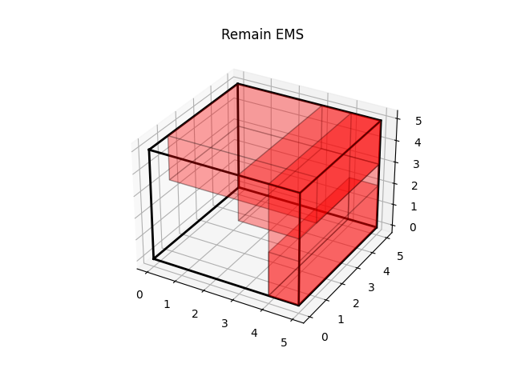

# Biased Random Key Generic Algorithm for 3D-Bin Packing Problem

* Implement the BRKGA for the 3D bin packing problem by Python with type hints.

## Command

```bash
# use mypy to check the Python code
make check
# run all example
make all-examples
```

## Algorithm

* 算法伪代码

```plaintext
初始化种群并计算适应度
for loop(最大迭代次数)
    提前终止：判断是否寻找到局部最优解（迭代一定次数之后最优适应度没有变化），终止循环，返回优化结果
    分割种群：根据适应度将父代分为elites和non-elites种群
    遗传染色(crossover)：对于每一个子代，从elites和non-elites中各挑选一个，通过遗传操作生成子代
    突变(mutation)：直接随机生成指定数量的individuals成为子代，增加子代的随机性
    elites, crossover和mutation共同构成子代种群，计算更新适应度函数，更新最优解
```

* Empty Maximal Space(EMS)：container中的可用空间, 最原始的EMS就是container本身（WHD）。假设将一个item放置在一个EMS中的某个位置，则根据item和EMS的相对位置可以生成新的6个EMSs（理论上最多有6个新的EMSs）。使用left-down-back和right-up-front的6维数组记录EMS

```python
x1, y1, z1, x2, y2, z2 = overlapped_EMS
x3, y3, z3, x4, y4, z4 = item_ems
new_EMSs = np.vstack(
    [
        np.array([x4, y1, z1, x2, y2, z2]),  # front EMS
        np.array([x1, y4, z1, x2, y2, z2]),  # right EMS
        np.array([x1, y1, z4, x2, y2, z2]),  # up EMS
        np.array([x1, y1, z1, x3, y2, z2]),  # back EMS
        np.array([x1, y1, z1, x2, y3, z2]),  # left EMS
        np.array([x1, y1, z1, x2, y2, z3]),  # down EMS
    ]
)
```

* 编码：给定n个item，则种群的individual由2n位数值在[0,1]的实数编码组成，前n位编码了n个item的放置顺序（准确来说是尝试放置的顺序），按照数值从小到大尝试放置，记为Box Packing Sequence(BPS)。后n位编码了该位置的item的放置方式，对于一个长方体，总共有6种放置方式，记录当前item的可行的放置方式（小于等于6），然后根据该数值乘以可行放置方式数量取整得到放置方式的索引（index），得到选择的方式方式，可行放置方式记为Vector of Box Orientation(VBO)，选择的放置方式记为Select Box Orientation(SBO)。

* 解码（适应度计算）：种群中的每一个individual都对应着一组放置方式（一组解）。

```plaintext
for loop(遍历所有的items：解码前n位得到尝试放置的顺序)
    for loop(遍历已使用的bins)
        从bin中选择可以放置下当前item的EMS
        根据该EMS和item选择BO：解码后n位得到当前item的放置方式
        修正当前放置位置：是不是“悬空”，4个corner是否被支撑
    如果已使用的bins放置不下当前item，则新开一个bin直到bin被用完
    更新当前bin对应的EMSs：
        删除被当前item包含（inscribed）的EMS
        记录并删除和当前item相交（intersected）的EMS
        for loop(遍历相交的EMS)
            生成6个新的EMSs
            剪枝：去掉体积小于未放置item最小体积的EMS；去掉最小尺寸小于未放置item最小尺寸的EMS；去掉被已有EMSs包含的EMS（inscribed）
            将剪枝完的EMSs添加到bin的EMSs中
```

* 适应度计算：

```plaintext
当给定bins无法放下所有的items时：
fit = bin number + 1 + 无法放置items的体积与bin体积之比

当给定bins可以放下所有的items时：
fit = used bin number + 1 - 放置体积最少的bin中的item数量与bin体积之比
```

## Example

|example | packing result | remaining EMSs |
|:-------------------------:|:-------------------------:|:-------------------------: |
| example0 |   |   |
| example1 |   |   |
| example2 |   |   |
| example3 |   |   |
| example4 |   |   |
| example5 |   |   |
| example6 |   |   |
| example7 |    |    |


## TODO

* 对于可行的放置方式，使用更好的适应度函数，将bin中item的重心分布，高度分布等考虑进去，进行更好的区分。

## Reference

* [3D-Bin-Packing-Problem-with-BRKGA](https://github.com/dasvision0212/3D-Bin-Packing-Problem-with-BRKGA)
* [3D-bin-packing](https://github.com/jerry800416/3D-bin-packing)
* [A biased random key genetic algorithm for 2D and 3D bin packing problems](https://www.sciencedirect.com/science/article/abs/pii/S0925527313001837)
